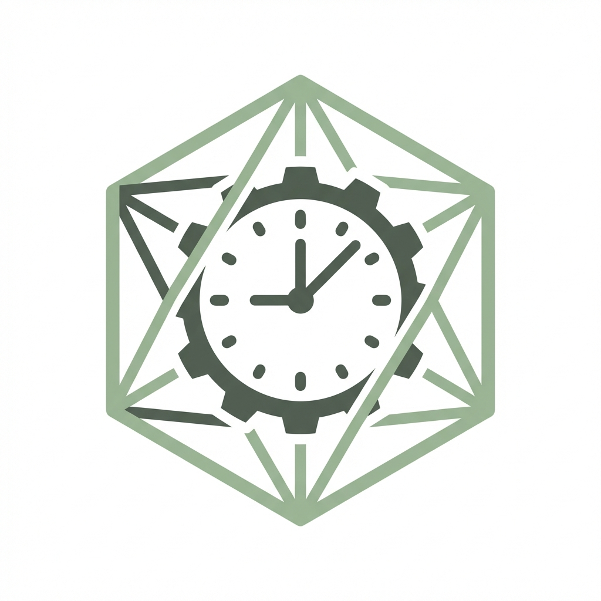

<div align="center">
  <br />
  
  <br />
  <h1 align="center">Quartz Control Center</h1>

  <p align="center">
    <strong>Enterprise-grade management interface for Quartz Scheduler</strong>
  </p>

  <p align="center">
    <a href="https://github.com/mesutpiskin/quartz-control-center/releases">
      
    </a>
    <a href="https://github.com/mesutpiskin/quartz-control-center/blob/main/LICENSE">
      
    </a>
    <a href="https://www.typescriptlang.org/">
      
    </a>
    <a href="https://www.electronjs.org/">
      
    </a>
    <a href="https://nextjs.org/">
      
    </a>
  </p>
  
  <br />
</div>

## 📋 Overview

**Quartz Control Center** is a robust, standalone management interface designed for enterprise applications using **Quartz Scheduler**. 

It eliminates the need for maintaining custom-built management UIs or running heavy Java-based tools just to inspect your scheduled tasks. By connecting directly to your persistence layer, it provides a centralized dashboard to visualize, monitor, and control your job execution environment in real-time.

### Key Capabilities
*   **Centralized Management:** Manage jobs and triggers across multiple environments (Dev, Test, Prod) from a single interface.
*   **Real-time Observability:** Monitor currently executing jobs and visualize load.
*   **Cross-Database Support:** Native support for PostgreSQL, Microsoft SQL Server, and MySQL.
*   **Deployment Flexibility:** Run as a native **Desktop App** (macOS) or as a containerized **Web Service** (Docker).


## Screenshots

<div align="center">
  
</div>


## Installation

### Desktop Application
The easiest way to get started. A self-contained Electron application that runs locally.

#### macOS (Apple Silicon)
[-white?style=for-the-badge&logo=apple)](https://github.com/mesutpiskin/quartz-control-center/releases/latest)

1.  Download the `.dmg` file from the [Releases Page](https://github.com/mesutpiskin/quartz-control-center/releases/latest).
2.  Open the file and drag **Quartz Control Center** to your Applications folder.

#### Windows (x64 / ARM64)
[](https://github.com/mesutpiskin/quartz-control-center/releases/latest)

1.  Download the `.exe` file from the [Releases Page](https://github.com/mesutpiskin/quartz-control-center/releases/latest).
2.  Run the installer (`Quartz Control Center-Setup.exe`).


### Docker
Ideal for shared team environments or hosted deployments.

```bash
git clone https://github.com/mesutpiskin/quartz-control-center.git
cd quartz-control-center
docker-compose up -d
```
Access the dashboard at `http://localhost:3000`.

### Development
```bash
npm install
npm run dev
```
Open http://localhost:3000 in your browser.

---

## Architecture & Tech Stack

The project is built as a monorepo using modern web technologies, ensuring performance and extensibility.

| Component | Technology | Description |
| :--- | :--- | :--- |
| **Frontend** | [Next.js 14](https://nextjs.org/) | React framework for the UI, ensuring fast rendering and static export capabilities. |
| **Backend** | [Express.js](https://expressjs.com/) | API layer handling database connections and Quartz SQL queries. |
| **Desktop** | [Electron](https://www.electronjs.org/) | Wraps the web app and API into a native executable. |
| **Styling** | [Tailwind CSS](https://tailwindcss.com/) | Utility-first CSS framework for a consistent, modern design system. |
| **State** | [React Query](https://tanstack.com/query) | Efficient server state management and caching. |

---

## Configuration

### Environment Variables
When running as a web service or in development, you can configure the application using `.env` files.

**API (`apps/api/.env`)**
```env
PORT=3001
CORS_ORIGIN=http://localhost:3000
NODE_ENV=production
```

**Web (`apps/web/.env`)**
```env
NEXT_PUBLIC_API_URL=http://localhost:3001
```


---

<div align="center">
<p>  if you like this project, please give a star on GitHub. </p>
<p><i>Special thanks to <a href="https://github.com/quartz-scheduler/quartz">Quartz Scheduler</a></i></p>
</div>

